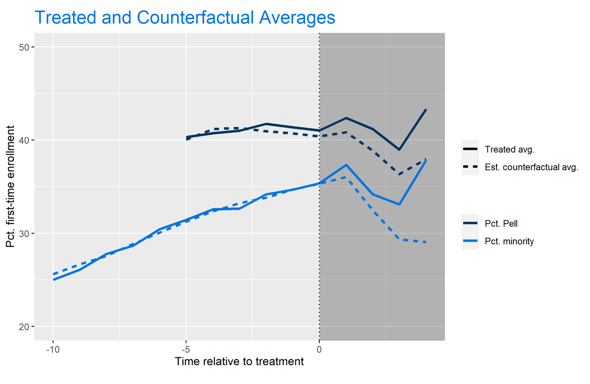
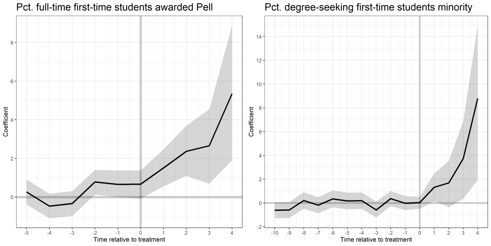

# The Generalized Synthetic Control Method: A Powerful ML Algorithm to Produce Counterfactual Estimates for Experimental Data

This post will cover the Generalized Synthetic Control method, a machine-learning algorithm that is lesser known within Data Science circles. Though this method is not often talked about, this quasi-experimental approach utilizes a robust latent-factor approach to synthetically produce counterfactuals for treated units. As a result, we can gather coefficient estimates and standard errors to assess and evaluate treatment effects of policy interventions. A policy-relevant example using this method will be provided.

## Why Generalized Synthetic Control?

The fundamental challenge of causal inference is the parallel trends assumption. To quote Angrist and Pischke (2009), two-way fixed effects models produce non-biased, causal estimates only in “parallel worlds.” This is a strong assumption to consider, as the unobserved counterfactual can rarely be produced using real data. For example, as a graduate student studying Data Science for Public Policy, it is impossible to know my post-graduation salary if I had _not_ attended graduate school. Luckily, we can rely on a combination of econometrics and machine learning to produce these counterfactual estimates while eliminating many of the confounding variables that may bias the typical difference-in-difference or fixed-effects regression models. This is where we turn to the Generalized Synthetic Control model.

## What is Generalized Synthetic Control?

The Generalized Synthetic Control Model “imputes counterfactuals for each treated unit using control group information based on a linear interactive fixed effects model that incorporates unit-specific intercepts interacted with time-varying coefficients” (Xu, 2017). Essentially, this supervised learning technique combines the interactive fixed-effects model and the synthetic control model, while employing a latent factor approach to provide valid, simulation-based uncertainty estimates.

The model first estimates an interactive fixed-effect model using only the control group data, obtaining a fixed number of latent factors using a cross-validation approach. In other words, the algorithm selects the number of latent factors, _k_, that minimizes the Mean Squared Prediction Error (MSPE). Next, the algorithm estimates factor loadings for each treated unit. Lastly, the algorithm imputes treated counterfactuals and standard errors based on the estimated factors and factor loadings. This is the step in which the $\beta$ coefficients are generated, while standard error estimates are calculated using bootstrapping techniques. These steps become much clearer once the visualizations are produced.

## Case Study: The Test-Optional Movement

Since 2003, institutions have increasingly begun to drop the standardized-testing requirement for admission. In the 2003-04 admission cycle, over 75% of degree-granting, 4-year institutions required either the SAT or ACT upon application. However, in 2018-19, this number had dropped to just 48.3% with institutions increasingly shifting towards a policy of neither recommending nor requiring scores.

Though most institutions who adopt this test-optional framework are under Private control, the Public sector has seen an increase in dropping test-requirements amidst the coronavirus pandemic. With the closing of many test-centers, many institutions are shifting away from the testing requirements in the 2021 admissions cycle. Given the uncertainty of the pandemic, however, it is possible that these policies may last longer than just one year. Using the Generalized Synthetic Control method, I can examine the post-implementation effects of this policy on low-income and minority enrollment.

The theoretical framework claims that less-privileged students may find more difficulty in both preparing for standardized tests and taking the test itself. Meanwhile, students who come from a more affluent background have greater access to both test-preparation and test-taking. By removing the burden of standardized test taking, the playing field can be more leveled regarding this aspect of the application. As a result, postsecondary access may become less challenging for underrepresented students. We can test this framework using the Generalized Synthetic Control method.

### Dataset

The pre-processing of the data would be conducted just as we would if we were running a two-way fixed-effects regression with unique Year-ID pairs. In other words, we want a panel data format such as the following (note this is fake data):

| Year | UnitID | Test-Optional? | Pct. Pell Enrollment | Pct. Minority Enrollment | … |
| ---- | ------ | -------------- | -------------------- | ------------------------ | - |
| 2003 | 367546 | 0  | 0.13  | 0.39  | … |
| 2003 | 485656 | 1  | 0.34  | 0.45  | … |
| 2003 | 324635 | 0  | 0.09  | 0.23  | … |
| …  | …  | …  | …  | ..  | … |
| 2017 | 367546 | 1  | 0.24  | 0.37  | … |
| 2017 | 485656 | 1  | 0.43  | 0.67  | … |
| 2017 | 324635 | 0  | 0.13  | 0.25  | … |

Once we have the data in this format, we’re ready to run the model. I’ll be conducting this algorithm with a sample of over 1000 4-year colleges and universities with data from the Integrated Postsecondary Education Data System (IPEDS). Since the algorithm automatically selects the number of latent factors that minimize MSPE, we do not need to worry as much about control variables as these will be captured in the latent factors. 

### Running the Algorithm
With the GSC model, I can combat the parallel trends assumption of causal inference with high-confidence uncertainty estimates. Using GSC, there needs to be a balance between the number of years an institution is in the “pre-treatment” period as well as the number of years following the implementation. The higher the minimum value of pre-treatment values set as the parameter, the less biased the results will be. However, as this value increases, the number of observations decrease. With that tradeoff in mind, I find the best balance for both models in using 6 pre-treatment periods in the Pell model and 11 pre-treatment periods in the URM model. Further, this allows for both models to be examined with four-years of post-policy implementation effects.

### Results
After running the algorithm, we get the following regression output:
|  | Pct. full-time first-time  students Pell |  Pct. degree-seeking first-time  students minority  |
|--------------------------------|-----------------------------------------|------------------------------|
| Test-optional  | 2.166***   (0.488)  | 2.287***   (0.728)  |  |
| Controls  | Yes  | Yes  |
| Institution/year fixed effects | Yes  | Yes  |
| Unobserved Factors  | 0  | 2  |
| Observations  | 1118  | 1055  |
| Treated  | 134  | 119  |
| Control  | 984  | 936  |

*Note:* Standard errors are based on parametric bootstraps (blocked at the institution level) of 2,500 times. Panel data from Title IV four-year degree-granting institutions. Years included are 2007-2017 in Column (1) and 2003-2017 in Column (2). *_p_<0.05, **_p_<0.01, ***_p_<0.001.

### Result Summary
In short, I find that dropping the test-requirement is associated with roughly a 2-percentage point increase in both first-time Pell enrollment and underrepresented minority enrollment. These results are significant at the 99.9% confidence interval with standard errors based on 2,500 parametric bootstraps blocked at the institution level.

A visualization of this algorithm is displayed below. The AUC between the treated (solid) and counterfactual (dashed) lines represent the beta estimate of the independent variable of interest (the policy-change). Note that we have less data on the Pell treated and counterfactual averages since this variable did not become available in the IPEDS universe until 2008.

The visualization above helps tremendously to explain how the Generalized Synthetic Control algorithm works. It uses factor loadings to match “treated” institutions with “control” institutions prior to treatment, so we can see where the control group would end up had they implemented the policy. In my experience as an econometrician, I believe the GSC algorithm creates a far more accurate measure of treatment effects than diff-in-diff or two-way fixed effects could by utilizing these factor weights and matching scores.  

Further, we can investigate the average treatment effects on the institutions with the test-optional policy by period:

These visualizations display the $\beta$ coefficients on the Y axis, the time relative to treatment on the X axis, and the 95% confidence interval in the shaded region. 

While the URM model is a bit nosier than the Pell model, we can still find significant treatment effects in years 3 and 4 after policy implementation. The visualization from the Pell model also tells us that there may be placebo effects apparent. This means that institutions that dropped the test-requirement were seeing a significant increase in Pct. Pell enrollment prior to their treatment (especially in time t – 2, where the null hypothesis that $\beta = 0$ falls out of the 95% confidence interval). This makes the results spurious, and more challenging to attribute the increase in Pell enrollment to the test-optional policy. We can see that there are no placebo effects apparent in the Pct. Minority model.

## Conclusions
The generalized synthetic control method is a wonderful supervised-learning approach to produce counterfactual estimates, eliminating much of the confoundedness found in OLS and Fixed-Effects regression techniques. Further, the algorithm allows you to produce beautiful visualizations that aid tremendously in explaining how the algorithm works to a non-technical audience. 
